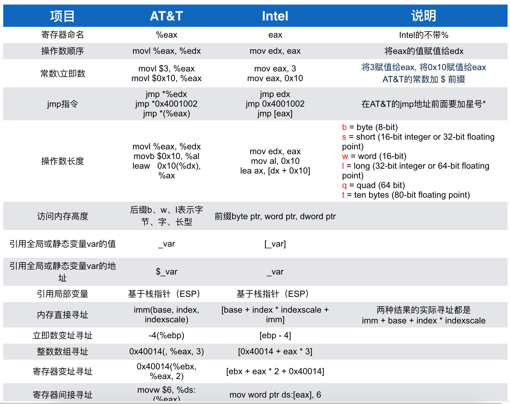

# lab00

## 实验目的

- 了解操作系统开发实验环境
- 熟悉命令行方式的编译、调试工程
- 掌握基于硬件模拟器的调试技术
- 熟悉C语言编程和指针的概念
- 了解X86汇编语言

## 了解OS实验


那我们准备如何一步一步来实现ucore呢？根据一个操作系统的设计实现过程，我们可以有如下的实验步骤：

1. 启动操作系统的 `bootloader`，用于了解操作系统启动前的状态和要做的准备工作，了解运行操作系统的硬件支持，操作系统如何加载到内存中，理解两类中断--“外设中断”，“陷阱中断”等；
2. 物理内存管理子系统，用于理解x86分段/分页模式，了解操作系统如何管理物理内存；
3. 虚拟内存管理子系统，通过页表机制和换入换出（swap）机制，以及中断-“故障中断”、缺页故障处理等，实现基于页的内存替换算法；
4. 内核线程子系统，用于了解如何创建相对与用户进程更加简单的内核态线程，如果对内核线程进行动态管理等；
5. 用户进程管理子系统，用于了解用户态进程创建、执行、切换和结束的动态管理过程，了解在用户态通过系统调用得到内核态的内核服务的过程；
6. 处理器调度子系统，用于理解操作系统的调度过程和调度算法；
7. 同步互斥与进程间通信子系统，了解进程间如何进行信息交换和共享，并了解同步互斥的具体实现以及对系统性能的影响，研究死锁产生的原因，以及如何避免死锁；
8. 文件系统，了解文件系统的具体实现，与进程管理等的关系，了解缓存对操作系统IO访问的性能改进，了解虚拟文件系统（VFS）、buffer cache和disk driver之间的关系。

## 了解编程开发调试的基本工具

### `AT&T` 汇编基本语法

基于 x86 架构 的处理器所使用的汇编指令一般有两种格式 : 

- Intel 汇编
	- DOS(8086处理器), Windows
	- Windows 派系 -> VC 编译器
- AT&T汇编
	- Linux, Unix, Mac OS, iOS(模拟器)
	- Unix派系 -> GCC编译器



### 寄存器和汇编的一些总结

e 表示 extend 的意思是扩展到了 32 位

eax/rax		accumulator register 返回值
ebx/rbx		base register 基址寄存器
ecx/rcx		counter register 计数器
edx/rdx		data register 数据寄存器

esi/rsi		source index 源地址指针寄存器
edi/rdi		destination index 目的地址指针寄存器
ebp/rbp		base pointer 基址指针寄存器
esp/rsp		stack pointer 堆栈指针寄存器

>其实现在大部分的寄存器都已经没有特殊功能了，只不过还保留了原始的命名方式。 `%rbp` 指向栈底， `%rsp` 指向栈顶， `%rip` 指向程序当前执行的地址。

## 

https://bbs.csdn.net/topics/392552998
http://www.ruanyifeng.com/blog/2018/01/assembly-language-primer.html

一般函数调用的开始都会执行 `pushq %rbp`

假设我们的代码如下

```cpp
void base();
void invoked();

void base()
{
    invoked();
}
```

在函数开始的时候，有一个基准地址，这个地址就是 invoked(); 这一行代码的地址，这个地址存放在 %rbp 中。

程序执行到 invoked() 函数内部时，首先我们需要将 %rbp 地址存起来，否则我们不知道当 invoked() 函数执行结束时下一步应该执行哪里的代码。

pushq %rbp 等同于以下两条指令

subq	$8, %rsp
moveq	%rbp, %rsp

意思就是，首先将栈指针 -8，这样 %rsp 指向的位置就是我们的被调用函数的栈开始的地址；将 %rbp 压入到函数栈开始的地方，这样当我们退出函数的时候我们就知道跳到哪里执行了

### 程序 DEBUG

```cpp
#include "stdio.h"

int add(int a, int b, int c)
{
	return a + b + c;
}

void invoke()
{
	add(1, 2, 3);
}

int main(void)
{
	invoke();
	return 0;
}
```

>在 ubuntu 下使用 `gcc` 编译后， gdb 执行

```
>>> p main
$1 = {<text variable, no debug info>} `0x400523` <main>
>>> p invoke 
$2 = {<text variable, no debug info>} `0x400509` <invoke>
>>> p add 
$3 = {<text variable, no debug info>} `0x4004ed` <add>
```

### 在 main 函数中

rbp 0x0000000000000000
rsp 0x00007fffffffded0

### 在 invoke 函数中

>在 invoke() 调用之前有一条指令 `mov %rsp %rbp` 修改了 %rsp 的值

rbp 0x00007fffffffded0
rsp 0x00007fffffffdec8

### 在 add 调用之前

rbp 0x00007fffffffdec0
rsp 0x00007fffffffdeb0

rdx 0x0000000000000003
rsi 0x0000000000000002
rdi 0x0000000000000001

### 在 add 调用之后

rbp 0x00007fffffffdec0
rsp 0x00007fffffffdea8

### 总结

结合我们之前提到的： `%rsp` 指向栈顶， `%rbp` 指向栈底。

每一个函数都拥有自己的栈，并且这个栈顶的位置存放在 `%rbp` 中，在函数开始执行的时候， **`%rsp` 的值会被自动的修改到指向新的栈的值**，而我们的程序则需要做如下操作：

1. 存放 `%rbp` 的值，因为我们待会需要修改它
2. 修改 `%rsp` 的值 == `%rbp`，因为现在的 %rbp 指向的是父函数的 base pointer，我们需要保存这个值，以便于当我们调用其他的函数时其他函数也能正常返回。
3. 对于每一个局部变量，我们使用 `%rsp` 来作为栈顶指针存放数据，每存放一个数据都需要修改 %rsp 的值。

在退出函数的时候则比较简单，只需要恢复刚才我们存储的 `%rbp` 地址即可。

所以我们的函数调用代码典型的是如下所示：

```asm
pushq	%rbp				# 保存上一个函数的 base pointer 到栈（注意， %rsp 的不需要被调用者修改）
mov 	%rsp %rbp			# 保存自身的 base pointer 以便于我们调用其他函数的时候能正常返回
subq 	$16, %rsp			# 开辟栈空间

# statement
# 记住一个问题，在访问局部变量的时候，是通过 %rbp 来访问的而不是 %rsp，因为 %rsp 有可能被它调用的函数改变

popq	%rbp				# 恢复上一个函数的 base pointer
ret							# 返回
```

## GCC基本内联汇编

### 基本内联汇编语句

```asm
    asm("nop"); asm("cli");
```

"asm" 和 "__asm__" 的含义是完全一样的。如果有多行汇编，则每一行都要加上 "\n\t"。其中的 “\n” 是换行符，"\t” 是 tab 符，在每条命令的 结束加这两个符号，是为了让 gcc 把内联汇编代码翻译成一般的汇编代码时能够保证换行和留有一定的空格。对于基本asm语句，GCC编译出来的汇编代码就是双引号里的内容。例如：

```asm
        asm( "pushl %eax\n\t"
             "movl $0,%eax\n\t"
             "popl %eax"
        );
```

实际上gcc在处理汇编时，是要把asm(...)的内容"打印"到汇编文件中，所以格式控制字符是必要的。再例如：

```asm
    asm("movl %eax, %ebx");
    asm("xorl %ebx, %edx");
    asm("movl $0, _boo);
```

在上面的例子中，由于我们在内联汇编中改变了 edx 和 ebx 的值，但是由于 gcc 的特殊的处理方法，即先形成汇编文件，再交给 GAS 去汇编，所以 GAS 并不知道我们已经改变了 edx和 ebx 的值，如果程序的上下文需要 edx 或 ebx 作其他内存单元或变量的暂存，就会产生没有预料的多次赋值，引起严重的后果。对于变量 `_boo` 也存在一样的问题。为了解决这个问题，就要用到扩展 GCC 内联汇编语法。

### GCC扩展内联汇编

```asm
#define read_cr0() ({ \
unsigned int __dummy; \
__asm__( \
    "movl %%cr0,%0\n\t" \
	    :"=r" (__dummy)); \
		__dummy; \
		})
```

它代表什么含义呢？这需要从其基本格式讲起。GCC扩展内联汇编的基本格式是： 

```asm
asm [volatile] ( Assembler Template
   : Output Operands
      [ : Input Operands
	     [ : Clobbers  ] ])
```

## 使用 qemu 模拟


