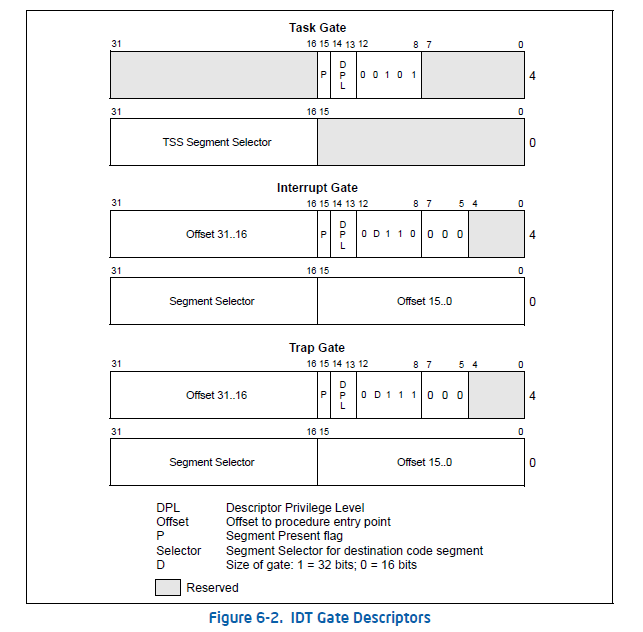

# 实验一：系统软件启动过程

## 实验目的：

操作系统是一个软件，也需要通过某种机制加载并运行它。在这里我们将通过另外一个更加简单的软件 - `bootloader` 来完成这些工作。

为此，我们需要完成一个能够切换到x86的保护模式并显示字符的bootloader，为启动操作系统ucore做准备。

## 练习

- 完成实验后，请分析ucore_lab中提供的参考答案，并请在实验报告中说明你的实现与参考答案的区别
- 列出你认为本实验中重要的知识点，以及与对应的OS原理中的知识点，并简要说明你对二者的含义，关系，差异等方面的理解（也可能出现实验中的知识点没有对应的原理知识点）
- 列出你认为OS原理中很重要，但在实验中没有对应上的知识点

## 练习1：理解通过make生成执行文件的过程。（要求在报告中写出对下述问题的回答）

在此练习中，大家需要通过静态分析代码来了解：

1. 操作系统镜像文件ucore.img是如何一步一步生成的？(需要比较详细地解释Makefile中每一条相关命令和命令参数的含义，以及说明命令导致的结果)
2. 一个被系统认为是符合规范的硬盘主引导扇区的特征是什么？
3. 如何调试Makefile

```makefile
# output commands
make "V="
```

## 项目组成

### bootloader部分

- boot/bootasm.S ：定义并实现了bootloader最先执行的函数start，此函数进行了一定的初始化， **完成了从实模式到保护模式的转换**，并调用bootmain.c中的bootmain函数。
- boot/bootmain.c：定义并实现了bootmain函数实现了通过屏幕、串口和并口显示字符串。bootmain函数加载ucore操作系统到内存，然后跳转到ucore的入口处执行。
- boot/asm.h：是bootasm.S汇编文件所需要的头文件，主要是一些与X86保护模式的段访问方式相关的宏定义。

### ucore操作系统部分

- 系统初始化部分：
	- kern/init/init.c：ucore操作系统的初始化启动代码
- 内存管理部分：
	- kern/mm/memlayout.h：ucore操作系统有关段管理（段描述符编号、段号等）的一些宏定义
	- kern/mm/mmu.h：ucore操作系统有关X86 MMU等硬件相关的定义，包括EFLAGS寄存器中各位的含义，应用/系统段类型，中断门描述符定义，段描述符定义，任务状态段定义，NULL段声明的宏SEG_NULL, 特定段声明的宏SEG，设置中 断门描述符的宏SETGATE（在练习6中会用到）
	- kern/mm/pmm.[ch]：设定了ucore操作系统在段机制中要用到的全局变量：任务状态段ts，全局描述符表 gdt[]，加载全局描述符表寄存器的函数lgdt，临时的内核栈stack0；以及对全局描述符表和任务状态段的初始化函数gdt_init
- 外设驱动部分：
	- kern/trap/vectors.S：包括256个中断服务例程的入口地址和第一步初步处理实现。注意，此文件是由tools/vector.c在编译ucore期间动态生成的；
	- kern/trap/trapentry.S：紧接着第一步初步处理后，进一步完成第二步初步处理；并且有恢复中断上下文的处理，即中断处理完毕后的返回准备工作；
	- kern/trap/trap.[ch]：紧接着第二步初步处理后，继续完成具体的各种中断处理操作；
- 内核调试部分：
	- kern/debug/kdebug.[ch]：提供源码和二进制对应关系的查询功能，用于显示调用栈关系。其中补全print_stackframe函数是需要完成的练习。其他实现部分不必深究。
	- kern/debug/kmonitor.[ch]：实现提供动态分析命令的kernel monitor，便于在ucore出现bug或问题后，能够进入kernel monitor中，查看当前调用关系。实现部分不必深究。
	- kern/debug/panic.c | assert.h：提供了panic函数和assert宏，便于在发现错误后，调用kernel monitor。大家可在编程实验中充分利用assert宏和panic函数，提高查找错误的效率。

## 从机器启动到操作系统运行的过程

### BIOS启动过程

当计算机加电后，一般不直接执行操作系统，而是执行系统初始化软件完成基本IO初始化和引导加载功能。简单地说， **系统初始化软件就是在操作系统内核运行之前运行的一段小软件。**

计算机启动后，CPU一开始会到一个特定的地址开始执行指令，这个特定的地址存放了系统初始化软件，负责完成计算机基本的IO初始化，这是系统加电后运行的第一段软件代码。对于Intel 80386的体系结构而言，PC机中的系统初始化软件由BIOS (Basic Input Output System，即基本输入/输出系统，其本质是一个固化在主板Flash/CMOS上的软件)和位于软盘/硬盘引导扇区中的OS Boot Loader（在ucore中的bootasm.S和bootmain.c）一起组成

### bootloader启动过程

BIOS将通过 **读取硬盘主引导扇区到内存**，并转跳到对应内存中的位置执行bootloader。bootloader完成的工作包括：

- 切换到保护模式，启用分段机制
- 读磁盘中ELF执行文件格式的ucore操作系统到内存
- 显示字符串信息
- 把控制权交给ucore操作系统

#### 保护模式和分段机制

没有一定的保护机制，任何一个应用软件都可以任意访问所有的计算机资源，这样也就无从谈起操作系统设计了。

[INTEL 80386 PROGRAMMER'S REFERENCE MANUAL 1986](https://css.csail.mit.edu/6.858/2014/readings/i386.pdf)

阅读第四、六、九、十章。在后续实验中，还可以进一步阅读第五、七、八等章节。

1. 实模式

在bootloader接手BIOS的工作后，当前的PC系统处于实模式（16位模式）运行状态。

实模式将整个物理内存看成分段的区域，程序代码和数据位于不同区域，操作系统和用户程序并没有区别对待，而且每一个指针都是指向实际的物理地址。

2. 保护模式

只有在保护模式下，80386的全部32根地址线有效，可寻址高达4G字节的线性地址空间和物理地址空间，可访问64TB（有2^14个段，每个段最大空间为2^32字节）的逻辑地址空间，可采用分段存储管理机制和分页存储管理机制。

>【补充】保护模式下，有两个段表：GDT（Global Descriptor Table）和LDT（Local Descriptor Table），每一张段表可以包含8192 (2^13)个描述符[1]，因而最多可以同时存在2 * 2^13 = 2^14个段。虽然保护模式下可以有这么多段，逻辑地址空间看起来很大，但实际上段并不能扩展物理地址空间，很大程度上各个段的地址空间是相互重叠的。目前所谓的64TB（2^(14+32)=2^46）逻辑地址空间是一个理论值，没有实际意义。在32位保护模式下，真正的物理空间仍然只有2^32字节那么大。注：在ucore lab中只用到了GDT，没有用LDT。

3. 分段存储管理机制

**只有在保护模式下才能使用分段存储管理机制**。 **分段机制将内存划分成以起始地址和长度限制这两个二维参数表示的内存块**，这些内存块就称之为段（`Segment`）。编译器把源程序编译成执行程序时用到的代码段、数据段、堆和栈等概念在这里可以与段联系起来，二者在含义上是一致的。

分段机涉及4个关键内容：`逻辑地址`、`段描述符`（描述段的属性）、`段描述符表`（包含多个段描述符的“数组”）、`段选择子`（段寄存器，用于定位段描述符表中表项的索引）。

转换逻辑地址（Logical Address,应用程序员看到的地址）到物理地址（Physical Address, 实际的物理内存地址）分以下两步：

1. 分段地址转换：CPU 把逻辑地址（由selector和段偏移offset组成）中的 selector 的内容作为 `GDT`（也可能是 `LDT`） 的索引，找到表中对应的段描述符，然后把段描述符中保存的段基址加上段偏移值，形成线性地址（Linear Address）。如果不启动分页存储管理机制，则线性地址等于物理地址
2. 分页地址转换，这一步中把线性地址转换为物理地址。（注意：这一步是可选的，由操作系统决定是否需要。在后续试验中会涉及。

#### 段描述符

在分段存储管理机制的保护模式下，每个段由如下三个参数进行定义：段基地址(Base Address)、段界限(Limit)和段属性(Attributes)。在ucore中的kern/mm/mmu.h中的struct segdesc 数据结构中有具体的定义。

### GDT 和  LDG

[GDT,LDT,GDTR,LDTR 详解](https://blog.csdn.net/chungle2011/article/details/80069703)

#### GDT（Global Descriptor Table）

1. 在整个系统中，全局描述符表GDT只有一张(一个处理器对应一个GDT)
2. GDT可以被放在内存的任何位置，但CPU必须知道GDT的入口，也就是基地址放在哪里，Intel的设计者门提供了一个寄存器GDTR用来存放GDT的入口地址
3. 程序员将GDT设定在内存中某个位置之后，可以通过 `LGDT` 指令将GDT的入口地址装入此寄存器
4. **GDTR中存放的是GDT在内存中的`基地址`和其`表长界限`。**


>[为什么要有 GDT](https://www.cnblogs.com/diegodu/p/3945068.html<Paste>)

在Protected Mode下，一个重要的必不可少的数据结构就是GDT（Global Descriptor Table）。

在Real Mode下，我们对一个内存地址的访问是通过 `Segment:Offset` 的方式来进行的，其中Segment是一个段的Base Address，一个Segment的最大长度是64 KB，这是16-bit系统所能表示的最大长度。而Offset则是相对于此Segment Base Address的偏移量。

Base Address+Offset就是一个内存绝对地址。由此，我们可以看出，一个段具备两个因素：Base Address和Limit（段的最大长度）， **而对一个内存地址的访问，则是需要指出：使用哪个段？以及相对于这个段Base Address的Offset** ，这个Offset应该小于此段的Limit。当然对于16-bit系统，Limit不要指定，默认为最大长度64KB，而 16-bit的Offset也永远不可能大于此Limit。我们在实际编程的时候，使用16-bit段寄存器CS（Code Segment），DS（Data Segment），SS（Stack Segment）来指定Segment，CPU将段积存器中的数值向左偏移4-bit，放到20-bit的地址线上就成为20-bit的Base Address。

到了Protected Mode，内存的管理模式分为两种，段模式和页模式，其中页模式也是基于段模式的。也就是说，Protected Mode的内存管理模式事实上是：纯段模式和段页式。进一步说，段模式是必不可少的，而页模式则是可选的——如果使用页模式，则是段页式；否则这是纯段模式。

既然是这样，我们就先不去考虑页模式。

**对于段模式来讲，访问一个内存地址仍然使用Segment:Offset的方式**，这是很自然的。由于 Protected Mode运行在32-bit系统上，那么Segment的两个因素：Base Address和Limit也都是32位的。IA-32允许将一个段的Base Address设为32-bit所能表示的任何值（Limit则可以被设为32-bit所能表示的，以2^12为倍数的任何指），而不象Real Mode下，一个段的Base Address只能是16的倍数（因为其低4-bit是通过左移运算得来的，只能为0，从而达到使用16-bit段寄存器表示20-bit Base Address的目的），而一个段的Limit只能为固定值64 KB。另外，Protected Mode，顾名思义，又为段模式提供了保护机制，也就说一个段的描述符需要规定对自身的访问权限（Access）。

所以，在Protected Mode下，对一个段的描述则包括3方面因素：`[Base Address, Limit, Access]`， **它们加在一起被放在一个64-bit长的数据结构中，被称为段描述符**。这种情况下，如果我们直接通过一个64-bit段描述符来引用一个段的时候，就必须使用一个64-bit长的段寄存器装入这个段描述符。但Intel为了保持向后兼容，将段寄存器仍然规定为16-bit（尽管每个段积存器事实上有一个64-bit长的不可见部分，但对于程序员来说，段积存器就是16-bit的），那么很明显，我们无法通过16-bit长度的段积存器来直接引用64-bit的段描述符。

**怎么办？解决的方法就是把这些长度为64-bit的段描述符放入一个数组中，而将段寄存器中的值作为下标索引来间接引用（事实上，是将段寄存器中的高13 -bit的内容作为索引）。这个全局的数组就是GDT。事实上，在GDT中存放的不仅仅是段描述符，还有其它描述符，它们都是64-bit长，我们随后再讨论。**

除了GDT之外，IA-32还允许程序员构建与GDT类似的数据结构，它们被称作LDT（Local Descriptor Table），但与GDT不同的是，LDT在系统中可以存在多个，并且从LDT的名字可以得知，LDT不是全局可见的，它们只对引用它们的任务可见，每个任务最多可以拥有一个LDT。另外，每一个LDT自身作为一个段存在，它们的段描述符被放在GDT中。

#### Selector(段选择子)

**段选择子就是实模式下的段寄存器**

由GDTR访问全局描述符表是通过“段选择子”（实模式下的段寄存器）来完成的，

段选择子包括三部分：描述符索引（index）、TI、请求特权级（RPL）。


- index : 表示所需要的 `Segment Descriptor` 在 `GDT` 的位置，由这个位置再根据在 `GDTR` 中存储的 `描述符表基址` 就可以找到相应的描述符。然后用描述符表中的段基址加上逻辑地址（SEL:OFFSET）的OFFSET就可以转换成线性地址
- TI 表示 GDT 或者 LDT
- RPL 选择子的特权级

关于特权级的说明：任务中的每一个段都有一个特定的级别。每当一个程序试图访问某一个段时，就将该程序所拥有的特权级与要访问的特权级进行比较，以决定能否访问该段。系统约定，CPU只能访问同一特权级或级别较低特权级的段。

例如给出逻辑地址：21h:12345678h转换为线性地址

1. 选择子SEL=21h=0000000000100 0 01b 他代表的意思是：选择子的index=4即100b选择GDT中的第4个描述符；TI=0代表选择子是在GDT选择；左后的01b代表特权级RPL=1
2. OFFSET=12345678h若此时GDT第四个描述符中描述的段基址（Base）为11111111h，则线性地址=11111111h+12345678h=23456789h

#### LDG(Local Descriptor Table)

局部描述符表可以有若干张，每个任务可以有一张。我们可以这样理解GDT和LDT： **GDT为一级描述符表，LDT为二级描述符表**


#### 实例

In order to reference a segment, a program must use its index inside the GDT or the LDT. Such an index is called a segment selector or selector in short. The selector must generally be loaded into a segment register to be used. Apart from the machine instructions which allow one to set/get the position of the GDT (and of the Interrupt Descriptor Table) in memory, every machine instruction referencing memory has an implicit Segment Register, occasionally two. Most of the time this Segment Register can be overridden by adding a Segment Prefix before the instruction.

当我们访问一个位于保护模式的内存时，首先我们需要装载段选择子到 `Segment Register`，随后我们通过 `Segment Register` 寄存器去查 `GDT` 得到线性地址。

### 地址空间

分段机制涉及5个关键内容：`逻辑地址`，`物理地址`，`段描述符表`，`段描述符`，`段选择子`

总的来说，一次物理地址寻址过程如下：

1. 通过逻辑地址得到 selector 和 offset
2. 通过 selector 查询段描述符表得到对应的段描述符（需要借助 GDTR）
3. 使用得到的段描述符拿到段的物理地址的基址，加上 offset 之后就得到 linear address。如果没有开启分页机制，那么这个地址就是实际的物理地址。

#### 逻辑地址空间

```c
int val = 100;
int * point=&val;
```

其中指针变量point中存储的即是一个逻辑地址。在基于80386的计算机系统中，**逻辑地址有一个16位的段寄存器（也称段选择子，段选择子）和一个32位的偏移量构成。**

#### 物理地址空间

物理地址空间就是一个“大数组”，CPU通过索引（物理地址）来访问这个“大数组”中的内容。物理地址是指CPU提交到 `内存总线` 上用于访问计算机内存和外设的最终地址。

物理地址空间的大小取决于CPU实现的物理地址位数，在基于80386的计算机系统中，CPU的物理地址空间为4GB，如果计算机系统实际上有1GB物理内存（即我们通常说的内存条），而其他硬件设备的IO寄存器映射到起始物理地址为3GB的256MB大小的地址空间，则该计算机系统的物理地址空间如下所示：

```
+------------------+  <- 0xFFFFFFFF (4GB)
|     无效空间     |
|                  |
+------------------+  <- addr:3G+256M
|     256MB        |
|   IO外设地址空间 |
|                  |
+------------------+  <- 0xC0000000(3GB)
|                  |
/\/\/\/\/\/\/\/\/\/\

/\/\/\/\/\/\/\/\/\/\
|     无效空间      |
+------------------+  <- 0x40000000(1GB)
|                  |
|    实际有效内存  |
|                  |
+------------------+  <- 0x00100000 (1MB)
|     BIOS ROM     |
+------------------+  <- 0x000F0000 (960KB)
|  16-bit devices, |
|  expansion ROMs  |
+------------------+  <- 0x000C0000 (768KB)
|   VGA Display    |
+------------------+  <- 0x000A0000 (640KB)
|                  |
|    Low Memory    |
|                  |
+------------------+  <- 0x00000000
```

#### 线性地址空间

CPU实现的线性地址位数，在基于80386的计算机系统中，CPU的线性地址空间为4GB。线性地址空间会被映射到某一部分或整个物理地址空间，并通过索引（线性地址）来访问其中的内容。线性地址又称虚拟地址，是进行逻辑地址转换后形成的地址索引，用于寻址线性地址空间。但CPU未启动分页机制时，线性地址等于物理地址；当CPU启动分页机制时，线性地址还需经过分页地址转换形成物理地址后，CPU才能访问内存硬件和外设。

### 硬盘访问概述

bootloader让CPU进入保护模式后，下一步的工作就是从硬盘上加载并运行OS。

考虑到实现的简单性，bootloader的访问硬盘都是LBA模式的PIO（Program IO）方式， **即所有的IO操作是通过CPU访问硬盘的IO地址寄存器完成。**

一般主板有2个IDE通道，每个通道可以接2个IDE硬盘。访问第一个硬盘的扇区可设置IO地址寄存器0x1f0-0x1f7实现的，具体参数见下表。一般第一个IDE通道通过访问IO地址0x1f0-0x1f7来实现，第二个IDE通道通过访问0x170-0x17f实现。每个通道的主从盘的选择通过第6个IO偏移地址寄存器来设置。

| IO地址 | 功能                                                                        |
|--------|-----------------------------------------------------------------------------|
| 0x1f0  | 读数据，当0x1f7不为忙状态时，可以读                                         |
| 0x1f2  | 要读写的扇区数，每次读写前，你需要表明你要读写几个扇区。最小是1个扇区       |
| 0x1f3  | 如果是LBA模式，就是LBA参数的0-7位                                           |
| 0x1f4  | 如果是LBA模式，就是LBA参数的8-15位                                          |
| 0x1f5  | 如果是LBA模式，就是LBA参数的16-23位                                         |
| 0x1f6  | 第0~3位：如果是LBA模式就是24-27位 第4位：为0主盘；为1从盘                   |
| 0x1f7  | 状态和命令寄存器。操作时先给命令，再读取，如果不是忙状态就从0x1f0端口读数据 |

### ELF文件格式概述

ELF(Executable and linking format)文件格式是Linux系统下的一种常用目标文件(object file)格式

- 用于执行的可执行文件(executable file)，用于提供程序的进程映像，加载的内存执行。 这也是本实验的OS文件类型。
- 用于连接的可重定位文件(relocatable file)，可与其它目标文件一起创建可执行文件和共享目标文件。
- 共享目标文件(shared object file),连接器可将它与其它可重定位文件和共享目标文件连接成其它的目标文件，动态连接器又可将它与可执行文件和其它共享目标文件结合起来创建一个进程映像。

```c
struct elfhdr {
  uint magic;  // must equal ELF_MAGIC
  uchar elf[12];
  ushort type;
  ushort machine;
  uint version;
  uint entry;  // 程序入口的虚拟地址
  uint phoff;  // program header 表的位置偏移
  uint shoff;
  uint flags;
  ushort ehsize;
  ushort phentsize;
  ushort phnum; //program header表中的入口数目
  ushort shentsize;
  ushort shnum;
  ushort shstrndx;
};
```

program header描述与程序执行直接相关的目标文件结构信息，用来在文件中定位各个段的映像，同时包含其他一些用来为程序创建进程映像所必需的信息。可执行文件的程序头部是一个program header结构的数组， 每个结构描述了一个段或者系统准备程序执行所必需的其它信息。目标文件的 “段” 包含一个或者多个 “节区”（section） ，也就是“段内容（Segment Contents）” 。程序头部仅对于可执行文件和共享目标文件有意义。可执行目标文件在ELF头部的e_phentsize和e_phnum成员中给出其自身程序头部的大小。程序头部的数据结构如下表所示：

```c
struct proghdr {
  uint type;   // 段类型
  uint offset;  // 段相对文件头的偏移值
  uint va;     // 段的第一个字节将被放到内存中的虚拟地址
  uint pa;
  uint filesz;
  uint memsz;  // 段在内存映像中占用的字节数
  uint flags;
  uint align;
};
```

## 操作系统启动过程

当bootloader通过读取硬盘扇区把ucore在系统加载到内存后，就转跳到ucore操作系统在内存中的入口位置（ **kern/init.c中的 `kern_init` 函数的起始地址** ），这样ucore就接管了整个控制权。

当前的ucore功能很简单，只完成基本的内存管理和外设中断管理。ucore主要完成的工作包括：

1. 初始化终端；
2. 显示字符串；
3. 显示堆栈中的多层函数调用关系；
4. 切换到保护模式，启用分段机制；
5. 初始化中断控制器，设置中断描述符表，初始化时钟中断，使能整个系统的中断机制；
6. 执行while（1）死循环。

### 函数堆栈

理解调用栈最重要的两点是：

1. 栈的结构
2. EBP寄存器的作用。

一个函数调用动作可分解为：

1. 零到多个PUSH指令（用于参数入栈）
2. 一个CALL指令。CALL指令内部其实还暗含了一个将返回地址（即CALL指令下一条指令的地址）压栈的动作（由硬件完成）。

几乎所有本地编译器都会在每个函数体之前插入类似如下的汇编指令：

```asm
pushl	%ebp
movl	%esp , %ebp
```

这两条汇编指令的含义是：首先将ebp寄存器入栈，然后将栈顶指针esp赋值给ebp。“mov ebp esp”这条指令表面上看是用esp覆盖ebp原来的值，其实不然。因为给ebp赋值之前，原ebp值已经被压栈（位于栈顶），而新的ebp又恰恰指向栈顶。此时ebp寄存器就已经处于一个非常重要的地位，该寄存器中存储着栈中的一个地址（原ebp入栈后的栈顶），从该地址为基准，向上（栈底方向）能获取返回地址、参数值，向下（栈顶方向）能获取函数局部变量值，而该地址处又存储着上一层函数调用时的ebp值。

>我对下面的这个图有一些疑问：实际上 `pushl %ebp` 等同于两条指令
><br/>
>movl %ebp %esp
><br/>
>subl %esp 8
><br/>
>那么在存储 %ebp 的值之后，其实修改了 %rsp 指针的地址。再执行一次 `movl %esp, %ebp` 应该不同于下图

```
+| 栈底方向    | 高位地址
 | ...         |
 | ...         |
 | 参数3       |
 | 参数2       |
 | 参数1       |
 | 返回地址    |
 | 上一层[ebp] | <-------- [ebp]
 | 局部变量    | 低位地址
```

### 中断与异常

操作系统需要对计算机系统中的各种外设进行管理，这就需要CPU和外设能够相互通信才行。一般外设的速度远慢于CPU的速度。如果让操作系统通过CPU“主动关心”外设的事件，即采用通常的轮询(polling)机制，则太浪费CPU资源了。

所以引入了中断。中断机制给操作系统提供了处理意外情况的能力，同时它也是实现进程/线程抢占式调度的一个重要基石。但中断的引入导致了对操作系统的理解更加困难。

在操作系统中，有三种特殊的中断事件。由CPU外部设备引起的外部事件如I/O中断、时钟中断、控制台中断等是异步产生的（即产生的时刻不确定），与CPU的执行无关，我们称之为 `异步中断`(asynchronous interrupt)也称外部中断,简称中断(interrupt)。

而把在CPU执行指令期间检测到不正常的或非法的条件(如除零错、地址访问越界)所引起的内部事件称作同步中断(synchronous interrupt)，也称内部中断，简称异常(exception)。

把在程序中使用请求系统服务的系统调用而引发的事件，称作陷入中断(trap interrupt)，也称软中断(soft interrupt)，系统调用(system call)简称trap。

当CPU收到中断或者异常的事件时，它会暂停执行当前的程序或任务，通过一定的机制跳转到负责处理这个信号的相关处理例程中，在完成对这个事件的处理后再跳回到刚才被打断的程序或任务中。

**中断向量和中断服务例程的对应关系主要是由IDT（中断描述符表）负责。操作系统在IDT中设置好各种中断向量对应的中断描述符，留待CPU在产生中断后查询对应中断服务例程的起始地址。而IDT本身的起始地址保存在idtr寄存器中。**

#### 中断描述符表

中断描述符表把每个中断或异常编号和一个指向中断服务例程的描述符联系起来。同GDT一样，IDT是一个8字节的描述符数组，但IDT的第一项可以包含一个描述符。CPU把中断（异常）号乘以8做为IDT的索引。IDT可以位于内存的任意位置，CPU通过IDT寄存器（IDTR）的内容来寻址IDT的起始地址。

指令LIDT和SIDT用来操作IDTR。两条指令都有一个显示的操作数：一个6字节表示的内存地址。

- LIDT（Load IDT Register）指令：使用一个包含线性地址基址和界限的内存操作数来加载IDT。操作系统创建IDT时需要执行它来设定IDT的起始地址。这条指令只能在特权级0执行。
- SIDT（Store IDT Register）指令：拷贝IDTR的基址和界限部分到一个内存地址。这条指令可以在任意特权级执行。

中断处理过程是有CPU直接调用的，CPU有专门的寄存器IDTR来保存IDT在内存中的位置，本文写为 `IDTR.base` 。IDTR有48为，前32为是IDT在内存中的位置（线性地址），后16为是IDT的大小，本文写为 `IDT.limit`。程序可以使用LIDT和SIDT指令来读写IDTR。

IDT是一个最大为256项的表，每个表项为8字节。称为中断门。CPU通过IDT.base+n*8来寻找门。

根据中断号对应的异常类型不同（ **Faults/Traps/Aborts** ）8个字节的意义也不同。



如上图所示IDT门中的 **最后两个byte是ISR在内存中的高16位**， **最开始前两个字节是ISR在内存中地址的低16位**。

#### lab1中对中断的处理实现

1. 外设基本初始化设置

Lab1实现了中断初始化和对键盘、串口、时钟外设进行中断处理。串口的初始化函数 `serial_init`（位于/kern/driver/console.c）中涉及中断初始化工作的很简单：

```c
//......
// 使能串口1接收字符后产生中断
outb(COM1 + COM_IER, COM_IER_RDI);
......
// 通过中断控制器使能串口1中断
pic_enable(IRQ_COM1);
```

键盘的初始化函数 `kbd_init`（位于kern/driver/console.c中）完成了对键盘的中断初始化工作，具体操作更加简单：

```c
//......
// 通过中断控制器使能键盘输入中断
pic_enable(IRQ_KBD);
```

时钟是一种有着特殊作用的外设，其作用并不仅仅是计时。在后续章节中将讲到，正是由于有了规律的时钟中断， **才使得无论当前CPU运行在哪里，操作系统都可以在预先确定的时间点上获得CPU控制权**。这样当一个应用程序运行了一定时间后，操作系统会通过时钟中断获得CPU控制权，并可把CPU资源让给更需要CPU的其他应用程序。时钟的初始化函数 `clock_init`（位于kern/driver/clock.c中）完成了对时钟控制器8253的初始化：

```c
    ......
//设置时钟每秒中断100次
    outb(IO_TIMER1, TIMER_DIV(100) % 256);
    outb(IO_TIMER1, TIMER_DIV(100) / 256);
// 通过中断控制器使能时钟中断
    pic_enable(IRQ_TIMER);
```

2. 中断初始化设置

**操作系统如果要正确处理各种不同的中断事件，就需要安排应该由哪个中断服务例程负责处理特定的中断事件。**

系统将所有的中断事件统一进行了编号（0～255），这个编号称为中断向量。以ucore为例，操作系统内核启动以后，会通过 `idt_init` 函数初始化 idt 表 (参见trap.c)，而其中 vectors 中存储了中断处理程序的入口地址。vectors 定义在 vector.S 文件中，通过一个工具程序 vector.c 生成。其中仅有 System call 中断的权限为用户权限 (DPL_USER)，即仅能够使用 int 0x80 指令。此外还有对 tickslock 的初始化，该锁用于处理时钟中断。

3. 中断的处理过程

trap函数（定义在trap.c中）是对中断进行处理的过程，所有的中断在经过中断入口函数__alltraps预处理后 (定义在 trapasm.S中) ，都会跳转到这里。

在处理过程中，根据不同的中断类型，进行相应的处理。在相应的处理过程结束以后，trap将会返回，被中断的程序会继续运行。整个中断处理流程大致如下

1. 产生中断后，CPU 跳转到相应的中断处理入口 (vectors)，并在桟中压入相应的 error_code（是否存在与异常号相关） 以及 trap_no，然后跳转到 alltraps 函数入口：
